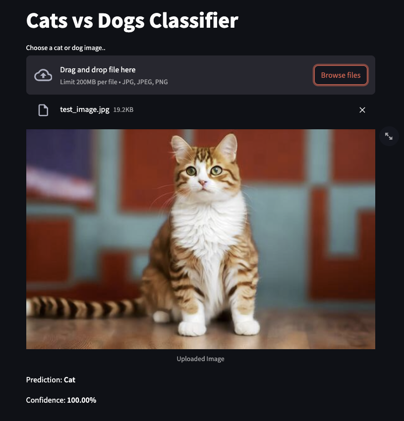

# Cats vs Dogs Classifier (PyTorch CNN + Streamlit)

A deep learning project that classifies **cats vs dogs** using **PyTorch** and **ResNet18**. Includes a **Streamlit web app** for real-time predictions.

---

## Features

- Classifies single images: Cat or Dog  
- Confidence score displayed  
- Data augmentation for robust performance  
- Streamlit web app for interactive predictions  

---

## Dataset
- Microsoft **PetImages** dataset

---

## Installation

```bash
git clone <repo-url>
cd cats-vs-dogs-classifier
pip install -r requirements.txt
```
---
**Test Accuracy:** 97.94%  
---

## Demo


