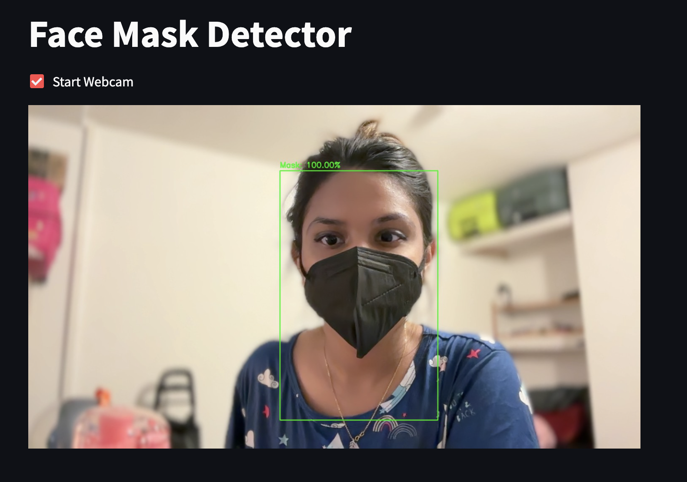
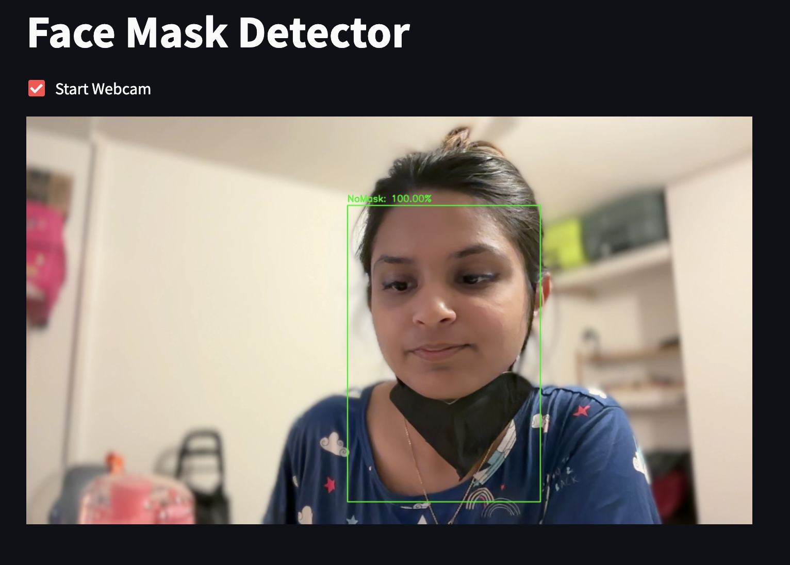

# Face Mask Detection

A real-time **Face Mask Detection** project using **PyTorch** and **ResNet18**, with webcam support via **Streamlit**. Detects whether a person is wearing a mask or not.

---

## Features

- Real-time webcam mask detection  
- Classifies faces as **Mask** or **NoMask**  
- Shows **confidence score** for each prediction  
- Can detect **multiple faces simultaneously**  
- Data augmentation for robust training  

---

## Dataset
- Microsoft **Face Mask 12k Images Dataset**  
- Pre-split into `train`, `validation`, and `test` sets  

---

## Installation

```bash
git clone <repo-url>
pip install -r requirements.txt
```
---
**Test Accuracy:** 99.80%
---

## Demo

<table>
  <tr>
    <td align="center">
      <br>
      With Mask
    </td>
    <td align="center">
      <br>
      Without Mask
    </td>
  </tr>
</table>
