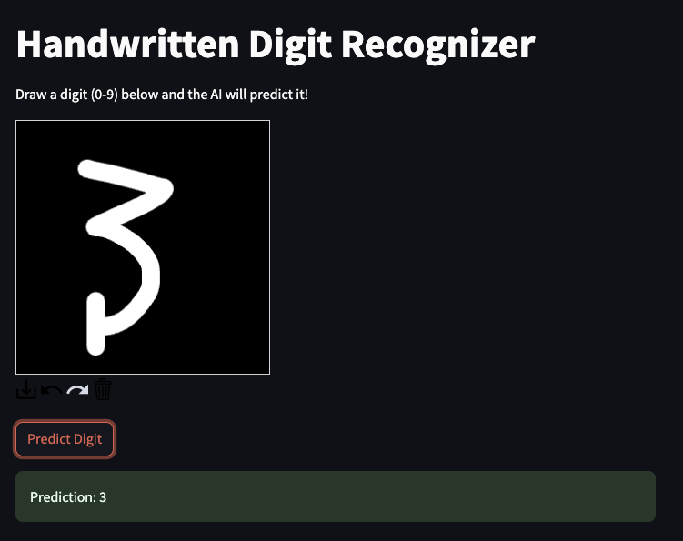

# Handwritten Digit Recognizer (PyTorch CNN + Streamlit)

A simple **Convolutional Neural Network (CNN)** built with **PyTorch** that recognizes handwritten digits (0–9) from images.  
This project also includes an **interactive web app** built with **Streamlit** where you can draw digits and see real-time predictions.

---

## Features

- Train a CNN on the **MNIST dataset** (~98.97 accuracy)  
- Predict digits from images using a **trained PyTorch model**  
- **Interactive web app** for drawing digits and getting live predictions  

---

## Demo

Open the app locally and draw digits:

```bash
streamlit run app.py
```

Prediction:


